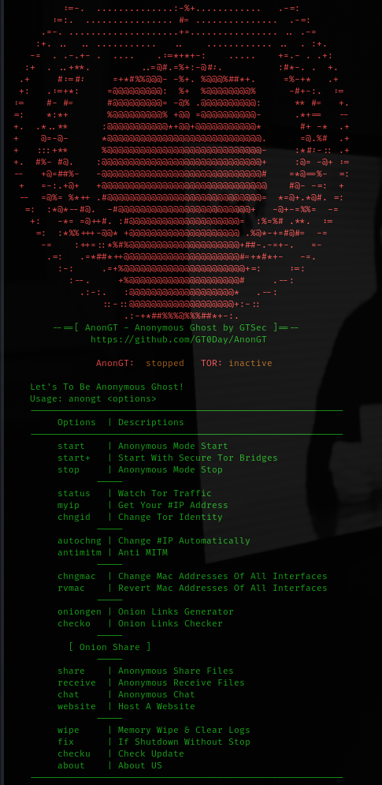

# AnonGT - Anonymous Ghost 

###### Redirect All Traffic Through Tor Network For Kali Linux v0.1.0

___

## Description

___

> ### Script to redirect all traffic through tor network including
> ### dns queries for anonymizing entire system
> ### killing dangerous applications
> ### clear configs & logs
> ### firefox browser anonymization
> ### Changing Mac Address
> ### I2P Services 

###### Please always check for updates

## Watch Video!
___

## AnonGT Install
___
> git clone https://github.com/gt0day/AnonGT;cd AnonGT && sudo bash install.sh;exit; 

## AnonGT Commands
___

### print banner help
> ### sudo anongt

### Anonymous Mode Start
> ### sudo anongt start

### Anonymous Mode Stop
> ### sudo anongt stop

### Anonymous Mode Change Tor IP
> ### sudo anongt chngid

### Watch Tor Traffic
> ### sudo anongt status

### Get Your Public Information
> ### sudo anongt myinfo

### Change Mac Address For All Interfaces
> ### sudo anongt chngmac

### Revert Mac Address For All Interfaces
> ### sudo anongt rvgmac

### Clear Configs & Logs
> ### sudo anongt wipe

## Tested On

___ 
> ### Kali Linux 2023.3

## Uninstall

___
> ### sudo rm -r /usr/share/anongt /usr/bin/anongt /var/lib/anongt;

